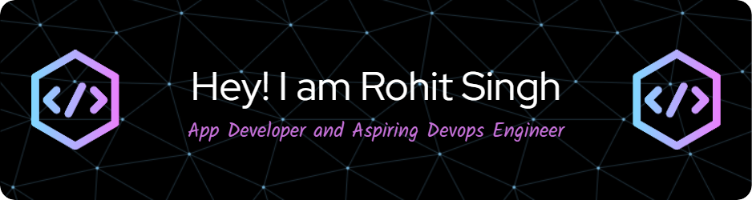

  

  

 

<ul>
  <h3>🌱 I’m currently learning <strong>DevOps, Flutter, Cloud Platforms</strong></h3>
  <h3>📝 I regularly write articles on <a href="https://www.linkedin.com/in/rohit-singh-11aa85250/recent-activity/articles/">LinkedIn</a></h3>
  <h3>💬 Ask me about <strong>Kotlin, Flutter, Android</strong></h3>
  <h3>📫 How to reach me <a href="mailto:rohitsingh290320052@gmail.com">rohitsingh290320052@gmail.com</a></h3>
  <h3>⚡ Fun fact: <strong>I have a great sense of humor 😅</strong></h3>
</ul>

<h3 align="left">Connect with me:</h3>

  
  
  

## 📊 Profile Summary  

                

<h3 align="left">Languages and Tools:</h3>

<table>
<tr>
<td align="center"> Android</td>
<td align="center"> AWS</td>
<td align="center"> C</td>
<td align="center"> Dart</td>
<td align="center"> Docker</td>
<td align="center"> Figma</td>
</tr>

<tr>
<td align="center"> Firebase</td>
<td align="center"> Flutter</td>
<td align="center"> Git</td>
<td align="center"> Java</td>
<td align="center"> JavaScript</td>
<td align="center"> Jenkins</td>
</tr>

<tr>
<td align="center"> Kotlin</td>
<td align="center"> Kubernetes</td>
<td align="center"> MongoDB</td>
<td align="center"> MySQL</td>
<td align="center"> Pandas</td>
<td align="center"> Python</td>
</tr>
</table>

  

&nbsp;
  

  

